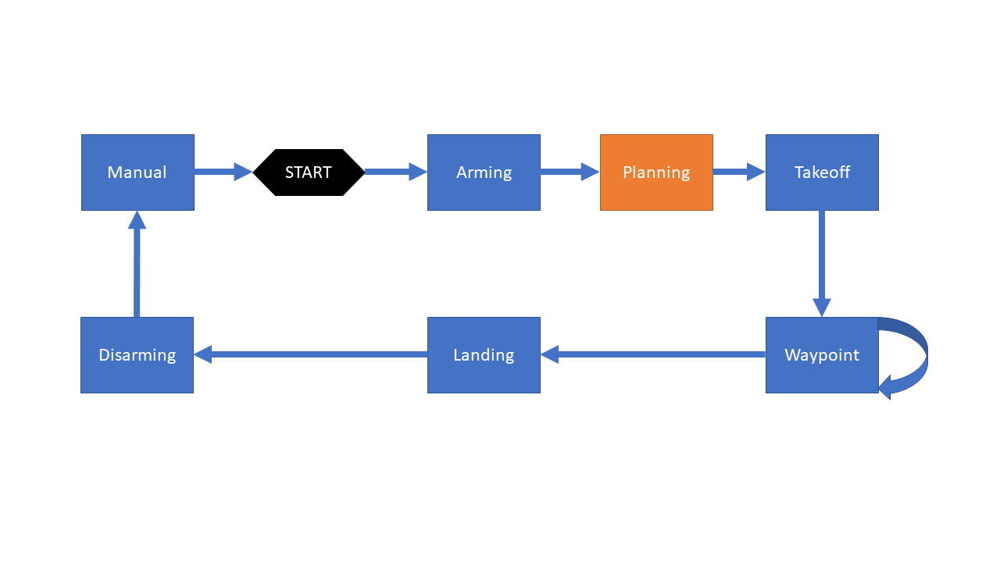
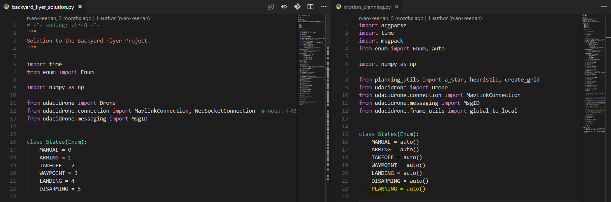
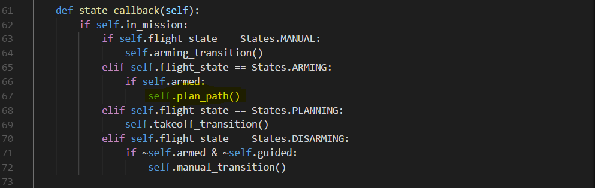
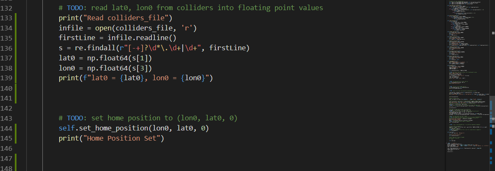
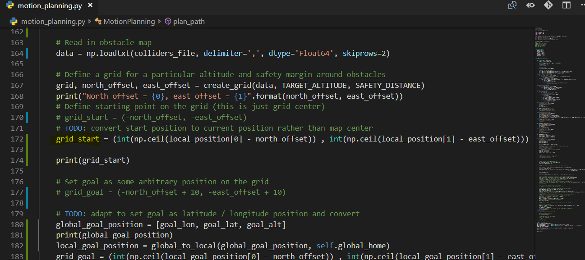
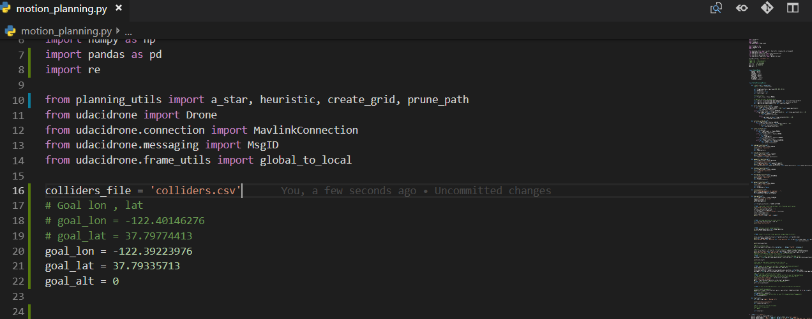
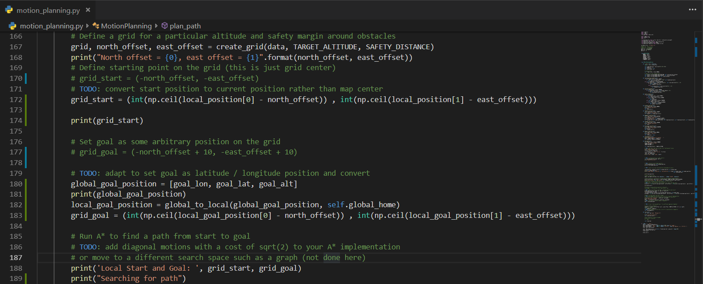
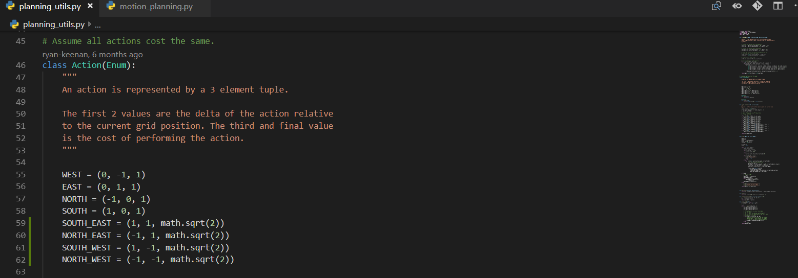
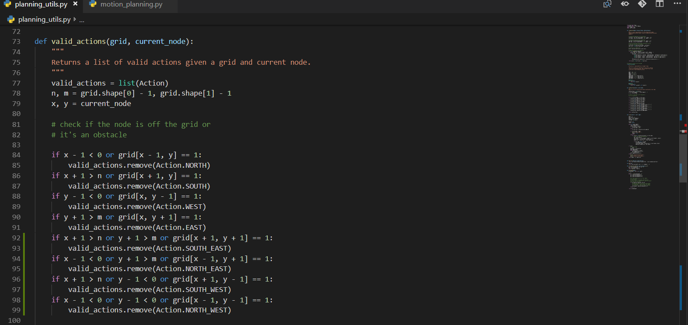
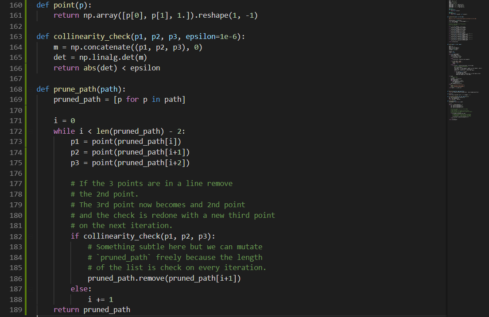

# FCND - 3D Motion Planning

## Writeup / README

### 1. Provide a Writeup / README that includes all the rubric points and how you addressed each one.  You can submit your writeup as markdown or pdf

You're reading it! Below I describe how I addressed each rubric point and where in my code each point is handled.

### Explain the Starter Code

#### 1. Explain the functionality of what's provided in `motion_planning.py` and `planning_utils.py`

##### Test that `motion_planning.py` is a modified version of `backyard_flyer_solution.py` for simple path planning. Verify that both scripts work. Then, compare them side by side and describe in words how each of the modifications implemented in `motion_planning.py` is functioning

`motion_planning.py` and `backyard_flyer_solution.py` are both state machine, the main difference will be the state both are using.  
The state of the `backyard_flyer_solution.py` are the folowing.

- Arming
- Takeoff
- Waypoint
- Landing
- Disarming
- Manual

For the `motion_planning.py` the state will be the same as `backyard_flyer_solution.py` but the difference is there is Planning state added in between Arming and Takeoff as shown in the diagram.

As seen below in `state_callback` after the drone is armed. It will call `plan_path()` which is responsible for planning by calculating waypoint for the drone before takeoff.

The `plan_path` method will do the following.

- Set the state to Planning
- Set Target Altitude and Safety Distance
- Load obstacle
- Create safty grid for our target altitude and safty distance by using `crete grid` method which provided in `planning_utils.py`
- Define start point
- Define Goal point
- Find a pathway by using `a_star` method which provided in `planning_utils.py`.
- Convert path to waypoint
- Set calculated waypoint

The `planning_utils.py` are consist of

- create grid
  - This will create grid with obstacles
  - The path way will be clear for safty fistance and altitude that we have set
- valid action
  - return list of action that the drone can go in the current node
- a star
  - Find a pathway
- heuristic
  - Find the cost of each cell position.

### Implementing Your Path Planning Algorithm

#### 1. Set your global home position

##### In the starter code, we assume that the home position is where the drone first initializes, but in reality you need to be able to start planning from anywhere. Modify your code to read the global home location from the first line of the colliders.csv file and set that position as global home (self.set_home_position())

As seen below first read the `colliders_file` which is `colliders.csv` then we assign `lat0` and `lon0` which will be the global home position.

#### 2. Set your current local position

##### In the starter code, we assume the drone takes off from map center, but you'll need to be able to takeoff from anywhere. Retrieve your current position in geodetic coordinates from self._latitude, self._longitude and self._altitude. Then use the utility function global_to_local() to convert to local position (using self.global_home as well, which you just set)

something somwthing something 

#### 3. Set grid start position from local position

##### In the starter code, the start point for planning is hardcoded as map center. Change this to be your current local position

As seen below this will set the grid start point to the drone current local position.

#### 4. Set grid goal position from geodetic coords

##### In the starter code, the goal position is hardcoded as some location 10 m north and 10 m east of map center. Modify this to be set as some arbitrary position on the grid given any geodetic coordinates (latitude, longitude)

The configuration for the goal position will be on the top of `motion_planning.py` 

and the goal will position will be set by using the goal that have been already input at the top of the `motion_planning.py`

#### 5. Modify A* to include diagonal motion (or replace A* altogether)

##### Write your search algorithm. Minimum requirement here is to add diagonal motions to the A* implementation provided, and assign them a cost of sqrt(2). However, you're encouraged to get creative and try other methods from the lessons and beyond!

As seen below this is the added part of diagonal motions and assign them as a cost of sqrt(2).

As seen below this is the `planning_utils.py` which has been already update to support diagonal motions .

#### 6. Cull waypoints

##### Cull waypoints from the path you determine using search.

As seen below this is the `planning_utils.py` the prune path function is pretty much the same as in lecture.

### Execute the flight

#### 1. Does it work ?

##### This is simply a check on whether it all worked. Send the waypoints and the autopilot should fly you from start to goal!

[Video 1](https://youtu.be/TKMiBsouNLs)

[Video 2](https://youtu.be/kAvvs-3BU_8)

[Video 3](https://youtu.be/Luv2qE8PgNw)

It works!